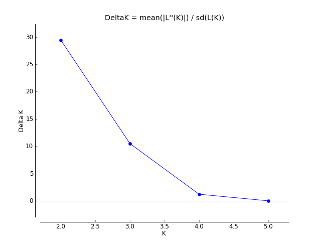

```{r, message=FALSE, warning=FALSE}
require(plotly)
require(hierfstat)
require(adegenet)
require(PopGenReport)
require(pheatmap)
require(tidyverse)
require(DiagrammeR)
require(poppr)
require(genepop)
require(graph4lg)
require(knitr)
require(pegas)
```


# Readme

This is an rstudio project. If you'd like to pre-rendered figures, read a summary of analysis and view code, please open the html file in a browser. 


To conduct the analyses on your computer, edit or run code: clone this repository into a directory on you r local machine and open the .Rproj file in Rstudio. All data and analyses are available in the github repository at https://github.com/david-dayan/rogue_half_pounder.git 

# Rationale 

In addition to winter early-summer and late-summer runs, some steelhead on the Rogue express a "half-pounder" life-history. Half-pounders exhibit a false-spawning run (although some precocious males may spawn) as juveniles during the summer months, then reutrn to sea to continue the marine growth phase. There is great interest in half-pounders from a management perspective, because (i) half pounder abundance should integrate juvenile freshwater and early ocean conditions for steelhead regardless of whether they express the half pounder phenotype (ii) half pounder abundance is predictive of steelhead abundance in historical dam passage counts, and (iii) half-pounders are a unique fishery of great cultural and economic value. However, the relative proportion of winter vs early summer vs late-summer run life histories expressed by half pounders later in life is unknown. Furthermore there is limited genetic information about the three adult runs of steelhead on the Rogue.

This study attempts to use neutral and adaptive GTseq markers to examine population structure and run timing among Rogue River steelhead. We also attempt to classify half-pounders into run-timing groups on the basis of run-timing associated genetic markers.

# Data Summary

## Samples

__Half Pounders__  
Samples were collected during ODFW’s Lower Rogue Seining Project in 2018 and 2019. The Lower Rogue Seining Project estimates escapement for Coho, late-summer run O. mykiss, half-pounder O. mykiss and fall chinook by beach seining near Huntley Park at approximate river mile 8, three times weekly from July through October. Half-pounder O. mykiss were identified as individuals with fork length 250 - 410mm and sampled in batches of up to 50 fish each day for 11 days from September 7th to October 1st 2018 totaling 384 individuals and 18 days from August 14th to September 25th 2019 totaling 331 individuals. Caudal fin clips were taken for DNA extraction, and placed in daily batch vials containing 95% ethanol. Note that due to batch collection of fin clips, that these numbers are inflated (some individuals have multiple tissue samples - identified later and filtered) 

All half-pounders are non-marked and assumed to be natural origin fish.

Also ~5% of samples represented twice in GTseq library as QAQC samples

__Adults__  
For brevity and easy code comprehension, throughout the notebook early-summer run steelhead are referred to as summer run and late-summer run steelhead are referred to as fall run.

45 winter and 45 early-run summer run fish. Adult summer steelhead were sampled at the Cole River Hatchery sorting pond on 6/26/2019 and (b) adult winter steelhead were sampled at Cole Rivers Hatchery (Rogue River) and the Applegate River from adult brood stock for 2019. Finally 166 additional late-summer run fish (fall run) were sampled at the Huntley Park seine on the lower Rogue.

All late-summer run adults are unmarked and assumed to natural origin fish. Winter run fish include NOR and HOR fish. After filtering the final dataset contains 18 HOR and 22 NOR fish. Early summer run fish are all unmarked and assumed NOR.

## Genotype Data

Information about sequencing data, genotype calling and filtering is available in the relevant R notebook (half_pounder_genotyping_notebook.Rmd) in this repository. 

```{r}
load("./genotype_data/genind_2.0.R")
load("./genotype_data/genotypes_2.2.R")
genos_2.2 <- ungroup(genos_2.2)
kable(genos_2.2 %>%
  group_by(run, year) %>%
  tally(), caption = "Final Filtered Dataset")
```


## Marker info

Throughout the notebook we refer to subsets of markers based on annotations provided by CRITFC. To my knowledge these annotations come from decisions made when the panel was assembled and edited (i.e. a run timing associated marker came out of a GWAS fro run timing). Broadly we examine 4 subsets of markers:  

(1) All markers: all 390 GTseq markers available in the full SFGL O mykiss GTseq panel. (The dataset here has fewer markers due to filtering - see genotyping notebook) (355 markers) 
(2) Neutral Markers: Any markers annotated as "neutral," with no other annotations. From my understanding these were mostly selected from broad spatial scale RADseq studies that refelct broad scale geographic structure and may or may not be in linkage with unkownn adaptive loci. (226 markers) 
(3) Adaptive Markers: any markers with a known adaptive functional annotation. (129 markers)   
(4) Run-timing markers: a subset of adaptive markers with specific associations with run-timing in O. mykiss. (14 markers) 

The table below demonstrates the annotations 

```{r}
marker_mapping <- readxl::read_xlsx("./metadata/final_mapping_results.xlsx", sheet = 1)

marker_summary <- marker_mapping %>%
  mutate(marker = str_replace(marker, "Omy(\\d+)", "Chr\\1")) %>%
  filter(marker %in% colnames(genos_2.2)) %>%
  mutate(neutral = if_else(str_detect(`Presumed Type`, 'neutral|Neutral'), "neutral", "adaptive")) %>%
  mutate(run_timing = if_else(str_detect(`Presumed Type`, 'run|Run'), "run_timing", "non-run_timing")) %>%
  dplyr::select(marker, chr, start, 'Presumed Type', neutral, run_timing, Source)

DT::datatable(marker_summary, options = list(pageLength=10))
```


# Workflow

Our primary goals:  
(a) examine population structure within and among the three run timing groups in the Rogue River (early summer, late summer and winter runs) (late summer referred to as fall in notebook)  
(b) classify half-pounders into run timing group.  

To begin, we will collect nucleotide diversity index at the marker and population levels, examine population structure at neutral and adaptive markers using multivariate and bayesian approaches, and assign half pounders to run timing groups based on a genetic classifier. 

# Diversity Metrics

Here we calculate both per-marker and per-population diversity metrics (Ho He HWE Fis and Fst)

## Heterozygosity

### Heterogyzity metrics

```{r, message=FALSE, warning=FALSE}
# first Ho and He
n.pop <- seppop(genind_2.0)

hobs <- lapply(n.pop, function(x) (summary(x)$Hobs))
hobs <- as.data.frame(t(do.call(rbind, hobs)))
hobs <- hobs %>%
  rownames_to_column(var="marker")
hobs <- hobs %>%
  pivot_longer(-marker, names_to = "run", values_to = "Ho")
#ggplot(hobs)+geom_boxplot(aes(x=pop, y=hobs))+theme_classic()+xlab("Run Timing")+ylab("Observed Heterozygosity")

hexp <- lapply(n.pop, function(x) (summary(x)$Hexp))
hexp <- as.data.frame(t(do.call(rbind, hexp)))
hexp <- hexp %>%
  rownames_to_column(var="marker") %>%
  pivot_longer(-marker, names_to = "run", values_to = "He")

marker_divs <- hexp %>%
  left_join(hobs)

#now lets add the annotation status (neutral vs adaptive)

marker_mapping <- readxl::read_xlsx("./metadata/final_mapping_results.xlsx", sheet = 1)

marker_divs <- marker_mapping %>%
  select(marker, `Presumed Type`) %>%
  mutate(marker = str_replace(marker, "Omy(\\d+)", "Chr\\1")) %>% #marker name convention is different
  mutate(neutral = if_else(str_detect(`Presumed Type`, 'Adaptive|adaptive'), "adaptive", "neutral")) %>%
  right_join(marker_divs)

# lets add known run-timing marker as a grouping variable, and conver to longer format
marker_divs <-  marker_divs %>%
  mutate(run_timing_marker = if_else(str_detect(`Presumed Type`, 'Run|run'), "run" , "non-run")) %>%
   pivot_longer(c("Ho", "He"), names_to = "obs_exp", values_to ="H")

#nice, now lets make a long table


# lets throw up some nice plots here
# first for all markers
ggplot(data=marker_divs)+geom_boxplot(aes(x=run, y=H, fill = obs_exp))+scale_fill_viridis_d()+theme_classic()+ggtitle("all markers")

ggplot(data=marker_divs[marker_divs$neutral=="neutral",])+geom_boxplot(aes(x=run, y=H, fill = obs_exp))+scale_fill_viridis_d()+theme_classic()+ggtitle("neutral markers")

ggplot(data=marker_divs[marker_divs$neutral=="adaptive",])+geom_boxplot(aes(x=run, y=H, fill = obs_exp))+scale_fill_viridis_d()+theme_classic()+ggtitle("adaptive markers")


ggplot(data=marker_divs[marker_divs$run_timing_marker=="run",])+geom_boxplot(aes(x=run, y=H, fill = obs_exp))+scale_fill_viridis_d()+theme_classic()+ggtitle("run-timing markers")

```

### Significance Testing
Are these differences between populations significant? What about differences between nuetral and adaptive sets of loci. To test with the same number of loci (across populations) we'll use a monte-carlo test and 999 permutations. To test across different sets of loci (neutral vs adaptive), we'll use a simple t-test

```{r, cache=TRUE, warning=FALSE, message=FALSE}
#lets make a way to easily called different snp classes 
#"neutral" markers 

neutral_loci_names <- marker_mapping %>%
  filter(str_detect(`Presumed Type`, 'neutral|Neutral')) %>%
  dplyr::select(marker)

#different naming convention, lets fix
neutral_loci_names <- str_replace(neutral_loci_names$marker, "Omy28", "Chr28")

#run timing markers
run_timing_loci_names <- marker_mapping %>%
  filter(chr == "28" | CRITFC_chromosome == "28") %>%
  filter(str_detect(`Presumed Type`, 'run|Run')) %>%
  select(marker)

#different naming convention, lets fix
run_timing_loci_names <- str_replace(run_timing_loci_names$marker, "Omy28", "Chr28")

## test for all pairwise differences at run-timing markers
#make a pop separted genind at run timing markers
chr28_seppop  <- seppop(genind_2.0[loc=run_timing_loci_names])


# fall-half
a <- Hs.test(chr28_seppop$fall, chr28_seppop$halfpounder)

#fall-summer
b <- Hs.test(chr28_seppop$fall, chr28_seppop$Summer)

#fall-winter
c <- Hs.test(chr28_seppop$fall, chr28_seppop$Winter)

#half-summer
d <- Hs.test(chr28_seppop$halfpounder, chr28_seppop$Summer)

#half-winter
e <- Hs.test(chr28_seppop$halfpounder, chr28_seppop$Winter)

#summer-winter
f <- Hs.test(chr28_seppop$Summer, chr28_seppop$Winter)

#now make a nice table
df <- as.data.frame(cbind(c("fall", "fall", "fall", "half", "half", "summer"), c("half", "summer", "winter", "summer", "winter", "winter"), c(a$pvalue,b$pvalue,c$pvalue,d$pvalue,e$pvalue,f$pvalue)))
colnames(df) <- c("pop1", "pop2","p-value")
kable(df, caption = "Monte-Carlo p-value for difference in observed Heterozygosity at run-timing markers")

## Next lets look if there is increased/decreased diversity within a population at these markers compared to neutral
neutral_seppop  <- seppop(genind_2.0[loc=neutral_loci_names])


#fall
a <- t.test(summary(chr28_seppop$fall)$Hexp, summary(neutral_seppop$fall)$Hexp, alternative = "greater")

#half
b <- t.test(summary(chr28_seppop$halfpounder)$Hexp, summary(neutral_seppop$halfpounder)$Hexp, alternative = "less")


#summer
c <- t.test(summary(chr28_seppop$Summer)$Hexp, summary(neutral_seppop$Summer)$Hexp, alternative = "less")

#winter
d <- t.test(summary(chr28_seppop$Winter)$Hexp, summary(neutral_seppop$Winter)$Hexp, , alternative = "less")

#now make a nice table
df <- as.data.frame(cbind(c("fall", "half", "summer", "winter"),c(a$p.value,b$p.value,c$p.value,d$p.value)))
colnames(df) <- c("pop", "p-val")
kable(df, caption = "T-test p-value for difference He at run timing markers vs neutral markers")

```

All pairwise population comparisons of He at chr28 are significantly different (p=0.001) EXCEPT fall-halfpounder. Winter and Summer populations demonstrate significantly reduced He at chr28 markers relative to neutral markers.


Are there significant departures from HWE at the loci level?

```{r, cache=TRUE,warning=FALSE, message=FALSE}
# here we use the hw.test function from pegas (exact test based on Monte Carlo permutations of alleles, 1000 permutations)
HWE.test <- lapply(n.pop, function(x) hw.test(x, B=1000))

```

```{r , warning=FALSE, message=FALSE}
# here we take the list of dataframes of p-values and combine into a single dataframe
hwe <- reduce(HWE.test, cbind)
hwe <- hwe[,c(4,8,12,16)]
colnames(hwe) <- c("fall", "halfpounder", "summer", "winter")
hwe <- as.data.frame(hwe)

# next we correct for multiple comparisons
p.adj <- as.data.frame(apply(hwe, MARGIN = 2, function(x) p.adjust(x, "fdr")))
hwe_exceed <- p.adj %>% rownames_to_column(var="marker") %>%
  pivot_longer(-marker, names_to = "run", values_to = "fdr") %>%
  filter(fdr < 0.1)

a <- hwe_exceed%>%
  group_by(run) %>%
  tally()

kable(a, caption = "Number of markers significantly out of HWE")

```

Yes, see table above for number of SNPs outside of HWE (fdr < 0.1) per "population" 

```{r , warning=FALSE, message=FALSE}
#lets check if there is an enrichment of run-timing and adaptive markers in markers out of HWE in fall and half-pounders
hwe_exceed <- hwe_exceed %>%
  left_join(pivot_wider(marker_divs, names_from = obs_exp, values_from = H))

#lets get marker info, but only for markers in the panel
marker_mapping2 <- marker_mapping %>%
  mutate(marker = str_replace(marker, "Omy(\\d+)", "Chr\\1")) %>%
  filter(marker %in% colnames(genos_2.2))

# halfpunder enriched for run timing markers
a <- nrow(hwe_exceed[hwe_exceed$run=="halfpounder" & hwe_exceed$run_timing_marker=="run",])
c <- nrow(marker_mapping2)-a
b <- nrow(hwe_exceed[hwe_exceed$run=="halfpounder" & hwe_exceed$run_timing_marker!="run",])
d <- nrow(marker_mapping2)-b

hr <- fisher.test(matrix(c(a,b,c,d), nrow=2), alternative = "less")

#fall for run-timing markers
a <- nrow(hwe_exceed[hwe_exceed$run=="fall" & hwe_exceed$run_timing_marker=="run",])
c <- nrow(marker_mapping2)-a
b <- nrow(hwe_exceed[hwe_exceed$run=="fall" & hwe_exceed$run_timing_marker!="run",])
d <- nrow(marker_mapping2)-b

fr <- fisher.test(matrix(c(a,b,c,d), nrow=2), alternative = "less")

#halfpounder for adaptive markers
a <- nrow(hwe_exceed[hwe_exceed$run=="halfpounder" & hwe_exceed$neutral=="adaptive",])
c <- nrow(marker_mapping2)-a
b <- nrow(hwe_exceed[hwe_exceed$run=="halfpounder" & hwe_exceed$neutral!="adaptive",])
d <- nrow(marker_mapping2)-b

ha <- fisher.test(matrix(c(a,b,c,d), nrow=2), alternative = "less")

#fall for adaptive markers
a <- nrow(hwe_exceed[hwe_exceed$run=="fall" & hwe_exceed$neutral=="adaptive",])
c <- nrow(marker_mapping2)-a
b <- nrow(hwe_exceed[hwe_exceed$run=="fall" & hwe_exceed$neutral!="adaptive",])
d <- nrow(marker_mapping2)-b

fa <- fisher.test(matrix(c(a,b,c,d), nrow=2), alternative = "less")

#make a nice table
df <- as.data.frame(cbind(c("fall", "fall", "half", "half"),c("run", "all adaptive", "run", "all adaptive"),c(fr$p.value, fa$p.value, hr$p.value, ha$p.value), c(fr$estimate, fa$estimate, hr$estimate, ha$estimate)))
colnames(df) <- c("pop", "marker type", "p-val", "fold-enrichment")
kable(df, caption = "enrichment (fisher's exact test) of marker types among markers out of HWE")

```

Markers significantly out of HWE (Ho < He: excess of homozygotes) are enriched for run-timing markers, but not adaptive markers in the fall and half-pounder groups. 

Now let's make a nice visual representation of this information (fall and half pounder demonstrate a dearth of heterozygotes at run ting markers)
```{r , warning=FALSE, message=FALSE}
plot_data_half <- marker_divs %>%
  filter(run == "halfpounder") %>%
  pivot_wider( names_from = obs_exp, values_from = H)

ggplot(plot_data_half)+geom_point(aes(He, Ho, color = run_timing_marker))+geom_abline(aes(intercept=0, slope=1))+coord_equal(ratio=1)+ylim(0,0.6)+scale_color_viridis_d()+theme_classic()+ggtitle("halfpounder")

plot_data_fall <- marker_divs %>%
  filter(run == "fall") %>%
  pivot_wider( names_from = obs_exp, values_from = H)

ggplot(plot_data_fall)+geom_point(aes(He, Ho, color = run_timing_marker))+geom_abline(aes(intercept=0, slope=1))+coord_equal(ratio=1)+ylim(0,0.6)+scale_color_viridis_d()+theme_classic()+ggtitle("fall")
```

It's surprising that there is enrichment of run timing markers among markers out of HWE in the fall run from these figures, but double checked the code, still significant enriched... Meanwhile the results in halfpounders are very clear.

### Heterozygosity results summary

At neutral markers, there is a slight reduction of observed from expected heterozygosity, most pronounced among summer run fish. At run timing markers, there is a significant reduction in diversity (Ho) relative to neutral markers among the summer run and winter run fish (one-sided t-test), and increased diversity at fall run and half-pounders (not significant). Furthermore, there is an excess of homozygosity at run timing associated SNPs in the half-pounders (but not fall fish) suggesting some structure within this group. Among markers with significant departures from HWE within fall and half-pounders, there is a significant enrichment of run-timing associated markers (p = p-value = 1.707e-10 and p = p-value = 0.02129, odds ratios 6.513 and 5.63, respectively fisher's exact test), but not significant enrichment for markers annotated as adaptive overall.


## Fst

Let's move on to f-statistics. We'll use hierfstats for most of this work, so the first step is to convert to a hierfstat format. Then we'll calculate some basic statists and Fst (Nei)

```{r, warning=FALSE, message=FALSE}
fstat <- genind2hierfstat(genind_2.0)
colnames(fstat) <- c(pop, names(genind_2.0$loc.n.all))
# and also lets make datasets at different sets of loci, because hierfstat doesn't easily retain loci names for later use
fstat_neutral <- genind2hierfstat(genind_2.0[loc=neutral_loci_names])
colnames(fstat_neutral) <- c(pop, names(genind_2.0[loc=neutral_loci_names]$loc.n.all))
fstat_run_timing <- genind2hierfstat(genind_2.0[loc=run_timing_loci_names])
colnames(fstat_run_timing) <- c(pop, names(genind_2.0[loc=run_timing_loci_names]$loc.n.all))

#calculate datset wide basic stats
basicstats <- basic.stats(fstat)
basicstats_neutral <- basic.stats(fstat_neutral)
basicstats_run_timing <- basic.stats(fstat_run_timing)

kable(basicstats$overall, caption = "All markers Fstats")
kable(basicstats_neutral$overall, caption = "Neutral marker Fstats")
kable(basicstats_run_timing$overall, caption = "Run Timing Marker Fstats")


```

### Marker level Fst

Now let's look at the distribution of Fst and check if markers with certain annotations are enriched among outliers.

```{r, warning=FALSE, message=FALSE}
basicstats$perloc$run_timing <- if_else(rownames(basicstats$perloc) %in% run_timing_loci_names, "run", "non-run")
basicstats$perloc$neutral <- if_else(rownames(basicstats$perloc) %in% neutral_loci_names, "neutral", "adaptive")

ggplot(basicstats$perloc)+geom_histogram(aes(x=Fst, fill=neutral))+theme_classic()
ggplot(basicstats$perloc)+geom_histogram(aes(x=Fst, fill=run_timing))+theme_classic()

#check if any non-run timing markers have high Fst
#max((basicstats$perloc[basicstats$perloc$run_timing=="non-run",])$Fst, na.rm = TRUE)
```

Yes, there are some clear fst outlier loci in the dataset. These outliers are composed solely of known run-timing markers, but not all run-timing markers demostrate high differentiation. The maximum fst on a non-run-timing marker was `r max((basicstats$perloc[basicstats$perloc$run_timing=="non-run",])$Fst, na.rm = TRUE)`


### Pairwise Population Fst

Let's collect genetic distance info on pairs of pops as well (Weir and Cochran 1984). 

First, the full dataset:
```{r, cache=TRUE}
genet.dist(fstat, method="WC84")
```

Then just neutral loci:
```{r, cache=TRUE}
genet.dist(fstat_neutral, method="WC84")
```


Next let's test these Fst results to see if they are significant

To accomplish this we'll randomize over populations 1000 fold and then conduct a monte-carlo test. Note this approach is very computationally intensive, should find another one if we really want a significance test on Fst, skipped for now.

```{r, cache=TRUE, eval=FALSE}
mat.obs <- pairwise.WCfst(as.data.frame(cbind((genind_2.0$pop),genind_2.0$tab)))

NBPERM <- 100 # this is the number of permutations used for the p-values; for a publication at least 999 would be required.
mat.perm <- lapply(1:NBPERM, function(i) pairwise.WCfst(as.data.frame(cbind(sample(genind_2.0$pop, size = 882),genind_2.0$tab))))


allTests <- list()
 for(i in 1:(nrow(mat.obs)-1)){
   for(j in 2:nrow(mat.obs)){
   allTests[[paste(rownames(mat.obs)[i],rownames(mat.obs)[j],sep="-")]] <- as.randtest(na.omit(sapply(1:NBPERM, function(k) mat.perm[[k]][i,j])), mat.obs[i,j], alter="greater")
   }
}
```

### Fst Results Summary

Moderate differentiation between most pairwise pop comps (not fall and halfpounder), but as suspected, this is driven mostly by the run timing markers. When examining only neutral annotated loci, differentiation is extremely low (less than 1%). Also of note here is that both the neutral and total estimates of differentiation between early and late summer (fall) populations (4.2% and 0.9%, respectively) is quite high. Mean Fst over all loci is about half the level of differentation between early summer and winter populations (9.7%) and nearly the same when examining only neutral loci (1.1%). Indeed, the late summer run fish  demonstrate lower differentiation from winter run than early summer run fish at both neutral and all loci.

# Population Structure

From the Fst estimation in the section above we have our first ideas about population structure: (a) fall run and half pounder fish demonstrate little to no differentiation, and this group is less differentiated from winter run than summer run fish and (b) some evidence of structure WITHIN halfpounder and fall runs. In this section we will conduct several analyses to uncover population structure in greater detail. 

## STRUCTURE

Here we use a bayesian, model based clustering algorithm (STRUCTURE) to infer population structure and estimate admixture proportions of individual samples.

First we need to get our dataset ready for structure: remove linked loci, convert to structure format.
```{r, cache=TRUE, message=FALSE, warning=FALSE}
# first lets calculate LD (dartR has a great (fast) ld estimator that works right on genind files, so let's use this)
ldreport <- dartR::gl.report.ld(genind_2.0, name = NULL, save = FALSE, nchunks = 2, ncores = 3, chunkname = NULL)

```

We'll prune (keep one) the dataset of any locus-pairs with r2 > 0.2, then convert to STRUCTURE format
```{r, eval=FALSE}
unlinked_genind <- genind_2.0[loc=-unique(ldreport[ldreport$R2>0.2,]$loc2)]
rm(ldreport)
#note just sort of crashed through this with a text editor, not easily logged, but the general idea was transpose the data, split columns (diploid to dual haploid) then convert data to integers
df <- genind2df(unlinked_genind)
df <- as.data.frame(t(df))
write_tsv(df, "genotype_data/all.str.tmp")
df <- read_tsv("genotype_data/all.str.tmp", col_names = FALSE)
df <- t(df)
write_tsv(as.data.frame(df), "genotype_data/all.str", col_names = FALSE)

```

This removed 25 highly linked SNPs from the dataset.

### Run Log  

Structure was run in a GUI outside this computation notebook's environment.   
__admixture model:__ admixture, with correlated allele frequency  
__burnin/mcmc:__ ran with k=1-3 for 100k iteration to check for convergence of alpha, strong convergence after a few hundred burn-in iterations, used 10,000/20,000 for final runs   
__replicates:__ did 10 replicates for k=1-6 

Best K was chosen by the evanno method, and estimated in structure harvester.    
Replicate results within each K were clumpp'd using the clumpak algorithm on the clumpak webserver  

### Results

Here we visualize the structure results of the clumpp'd results of all K values

__Best K__

Best K was 2 according to the Evanno (delta K) method, however, it's important to remember the bias toward k=2 when differentiation is low or there is no population structure using this method. Delta k literally cannot evaluate K=1. (see note below)

note: delta K suggests best k is two, however, particularly at low differentiation, the delta k method is biased towards k=2 (cullingham 2020), seems like a good place to remind myself that k is a model that doesn't always fully catpure biological reality and comparing results across different levels of k can proide interesting insights, even when best k is unknown, particularly in the case of low differentiation. Also a note that it might be good to review the literature again on bayesian clustering methods for low levels of differentation, e.g. that gagnaire paper and latch 2006. 



__Structure Plots__

Next let's take the clumppd results and make some publication-ready figures. First plot is downsampled to 42 samples per "population", second plot is full dataset.

```{r,message=FALSE,warning=FALSE}
#import clump results into dataframes
# results are in files k*/majorcluster/clumppfiles/clumpindoutput
# took these files and captured the relevant data with a text editor (original input files are a mess with multiple field separators) and saved to new files
k2 <- read_tsv("./structure/halfpounder/clumpak/formatted_results/k2.txt")
k3 <- read_tsv("./structure/halfpounder/clumpak/formatted_results/k3.txt")
k4 <- read_tsv("./structure/halfpounder/clumpak/formatted_results/k4.txt")
k5 <- read_tsv("./structure/halfpounder/clumpak/formatted_results/k5.txt")


plot_data <- k2 %>% 
  rownames_to_column(var="id") %>% 
  group_by(pop) %>%
  sample_n(40) %>% # sample the half_pounder and fall fish to smaller size for plot
  ungroup() %>%
  gather('cluster', 'prob', clust1:clust2) %>%
  group_by(id) %>% 
  mutate(likely_assignment = cluster[which.max(prob)],
         assingment_prob = max(prob)) %>% 
  arrange(likely_assignment, desc(assingment_prob)) %>% 
  ungroup()

a <- ggplot(plot_data, aes(id, prob, fill = cluster)) +
  geom_col(width=1.0) +
  facet_grid(~pop, scales = 'free', space = 'free', switch = "x") +
  scale_y_continuous(expand = c(0, 0)) +
  scale_x_discrete(expand = expand_scale(add = 1)) +
  theme(panel.spacing=unit(0.1, "lines"), axis.title.x=element_blank(), axis.text.x=element_blank(), axis.ticks.x=element_blank(), legend.position = "none", axis.title.y=element_blank(), strip.background = element_rect(color = "white", fill = "white"), strip.text.x = element_blank()) +
  scale_fill_manual(values = viridisLite::viridis(2))

plot_data <- k3 %>% 
  rownames_to_column(var="id") %>% 
  group_by(pop) %>%
  sample_n(40) %>% # sample the half_pounder and fall fish to smaller size for plot
  ungroup() %>%
  gather('cluster', 'prob', clust1:clust3) %>%
  group_by(id) %>% 
  mutate(likely_assignment = cluster[which.max(prob)],
         assingment_prob = max(prob)) %>% 
  arrange(likely_assignment, desc(assingment_prob)) %>% 
  ungroup()

b <- ggplot(plot_data, aes(id, prob, fill = cluster)) +
  geom_col(width=1.0) +
  facet_grid(~pop, scales = 'free', space = 'free', switch = "x") +
  scale_y_continuous(expand = c(0, 0)) +
  scale_x_discrete(expand = expand_scale(add = 1)) +
  theme(panel.spacing=unit(0.1, "lines"), axis.title.x=element_blank(), axis.text.x=element_blank(), axis.ticks.x=element_blank(), legend.position = "none", axis.title.y=element_blank(), strip.background = element_rect(color = "white", fill = "white"), strip.text.x = element_blank()) +
  scale_fill_manual(values = viridisLite::viridis(3))

plot_data <- k4 %>% 
  rownames_to_column(var="id") %>% 
  group_by(pop) %>%
  sample_n(40) %>% # sample the half_pounder and fall fish to smaller size for plot
  ungroup() %>%
  gather('cluster', 'prob', clust1:clust4) %>%
  group_by(id) %>% 
  mutate(likely_assignment = cluster[which.max(prob)],
         assingment_prob = max(prob)) %>% 
  arrange(likely_assignment, desc(assingment_prob)) %>% 
  ungroup()

c <- ggplot(plot_data, aes(id, prob, fill = cluster)) +
  geom_col(width=1.0) +
  facet_grid(~pop, scales = 'free', space = 'free', switch = "x") +
  scale_y_continuous(expand = c(0, 0)) +
  scale_x_discrete(expand = expand_scale(add = 1)) +
  theme(panel.spacing=unit(0.1, "lines"), axis.title.x=element_blank(), axis.text.x=element_blank(), axis.ticks.x=element_blank(), legend.position = "none", axis.title.y=element_blank(), strip.background = element_rect(color = "white", fill = "white"), strip.text.x = element_blank()) +
  scale_fill_manual(values = viridisLite::viridis(4))

plot_data <- k5 %>% 
  rownames_to_column(var="id") %>% 
  group_by(pop) %>%
  sample_n(40) %>% # sample the half_pounder and fall fish to smaller size for plot
  ungroup() %>%
  gather('cluster', 'prob', clust1:clust5) %>%
  group_by(id) %>% 
  mutate(likely_assignment = cluster[which.max(prob)],
         assingment_prob = max(prob)) %>% 
  arrange(likely_assignment, desc(assingment_prob)) %>% 
  ungroup()

d <- ggplot(plot_data, aes(id, prob, fill = cluster)) +
  geom_col(width=1.0) +
  facet_grid(~pop, scales = 'free', space = 'free', switch = "x") +
  scale_y_continuous(expand = c(0, 0)) +
  scale_x_discrete(expand = expand_scale(add = 1)) +
  theme(panel.spacing=unit(0.1, "lines"), axis.title.x=element_blank(), axis.text.x=element_blank(), axis.ticks.x=element_blank(), legend.position = "none", axis.title.y=element_blank(), strip.background = element_rect(color = "white", fill = "white")) +
  scale_fill_manual(values = viridisLite::viridis(5))


cowplot::plot_grid(a,b,c,d, ncol=1)


plot_data <- k2 %>% 
  rownames_to_column(var="id") %>% 
 # sample the half_pounder and fall fish to smaller size for plot
  gather('cluster', 'prob', clust1:clust2) %>%
  group_by(id) %>% 
  mutate(likely_assignment = cluster[which.max(prob)],
         assingment_prob = max(prob)) %>% 
  arrange(likely_assignment, desc(assingment_prob)) %>% 
  ungroup()


a <- ggplot(plot_data, aes(id, prob, fill = cluster)) +
  geom_col(width=1.0) +
  facet_grid(~pop, scales = 'free', space = 'free', switch = "x") +
  scale_y_continuous(expand = c(0, 0)) +
  scale_x_discrete(expand = expand_scale(add = 1)) +
  theme(panel.spacing=unit(0.1, "lines"), axis.title.x=element_blank(), axis.text.x=element_blank(), axis.ticks.x=element_blank(), legend.position = "none", axis.title.y=element_blank(), strip.background = element_rect(color = "white", fill = "white"), strip.text.x = element_blank()) +
  scale_fill_manual(values = viridisLite::viridis(2))

plot_data <- k3 %>% 
  rownames_to_column(var="id") %>% 
  gather('cluster', 'prob', clust1:clust3) %>%
  group_by(id) %>% 
  mutate(likely_assignment = cluster[which.max(prob)],
         assingment_prob = max(prob)) %>% 
  arrange(likely_assignment, desc(assingment_prob)) %>% 
  ungroup()

b <- ggplot(plot_data, aes(id, prob, fill = cluster)) +
  geom_col(width=1.0) +
  facet_grid(~pop, scales = 'free', space = 'free', switch = "x") +
  scale_y_continuous(expand = c(0, 0)) +
  scale_x_discrete(expand = expand_scale(add = 1)) +
  theme(panel.spacing=unit(0.1, "lines"), axis.title.x=element_blank(), axis.text.x=element_blank(), axis.ticks.x=element_blank(), legend.position = "none", axis.title.y=element_blank(), strip.background = element_rect(color = "white", fill = "white"), strip.text.x = element_blank()) +
  scale_fill_manual(values = viridisLite::viridis(3))

plot_data <- k4 %>% 
  rownames_to_column(var="id") %>% 
  gather('cluster', 'prob', clust1:clust4) %>%
  group_by(id) %>% 
  mutate(likely_assignment = cluster[which.max(prob)],
         assingment_prob = max(prob)) %>% 
  arrange(likely_assignment, desc(assingment_prob)) %>% 
  ungroup()

c <- ggplot(plot_data, aes(id, prob, fill = cluster)) +
  geom_col(width=1.0) +
  facet_grid(~pop, scales = 'free', space = 'free', switch = "x") +
  scale_y_continuous(expand = c(0, 0)) +
  scale_x_discrete(expand = expand_scale(add = 1)) +
  theme(panel.spacing=unit(0.1, "lines"), axis.title.x=element_blank(), axis.text.x=element_blank(), axis.ticks.x=element_blank(), legend.position = "none", axis.title.y=element_blank(), strip.background = element_rect(color = "white", fill = "white"), strip.text.x = element_blank()) +
  scale_fill_manual(values = viridisLite::viridis(4))

plot_data <- k5 %>% 
  rownames_to_column(var="id") %>% 
  gather('cluster', 'prob', clust1:clust5) %>%
  group_by(id) %>% 
  mutate(likely_assignment = cluster[which.max(prob)],
         assingment_prob = max(prob)) %>% 
  arrange(likely_assignment, desc(assingment_prob)) %>% 
  ungroup()

d <- ggplot(plot_data, aes(id, prob, fill = cluster)) +
  geom_col(width=1.0) +
  facet_grid(~pop, scales = 'free', space = 'free', switch = "x") +
  scale_y_continuous(expand = c(0, 0)) +
  scale_x_discrete(expand = expand_scale(add = 1)) +
  theme(panel.spacing=unit(0.1, "lines"), axis.title.x=element_blank(), axis.text.x=element_blank(), axis.ticks.x=element_blank(), legend.position = "none", axis.title.y=element_blank(), strip.background = element_rect(color = "white", fill = "white")) +
  scale_fill_manual(values = viridisLite::viridis(5))


cowplot::plot_grid(a,b,c,d, ncol=1)
```

__STRUCTURE Results Summary__

(1) Regardless of number of putative ancestral genetic clusters (k) modeled, there was a high degree of admixture within individuals, consistent with the observation of high gene flow among a priori assigned groupings.  
(2) at K=3 and greater, there is a clear summer associated genetic cluster with highly variable amounts of introgression of this genetic cluster into fall and half pounder assigned fish, and to a lesser extent winter run fish  
(3) Similar to the results from k means clustering (see dapc below), as k increases, there is decreasing shared cluster membership among winter and summer run fish, while half pounder and fall run fish continue to split evenly among clusters  


## PCA

Below we perform an unconstrained ordination of genetic data for both the neutral and the full datasets using PCA (implemented in ade4 and adegenet)

### Neutral PCA
first we run pca only on the neutral dataset
```{r, message=FALSE, warning=FALSE}
neutral_genind <- genind_2.0[loc=neutral_loci_names]

#replace missing data using mean allele frequency
neutral_genind_scale <- scaleGen(neutral_genind, NA.method="mean")

# run the PCA, dudi.pca uses an interactive prompt to choose pcs to retain, we retain all in order to run some analyses on eigenvalues
pca1 <- dudi.pca(neutral_genind_scale,cent=FALSE,scale=FALSE, scannf = FALSE, nf = 332)
barplot(pca1$eig[1:332],main="PCA eigenvalues")
s.class(pca1$li, pop(neutral_genind),xax=1,yax=2, col=transp(viridisLite::viridis(4),0.7), axesell=FALSE, cstar=0, cpoint=1, grid=FALSE)
add.scatter.eig(pca1$eig[1:10],nf=3,xax=1,yax=2)

```

Let's also make an interactive 3d plot, since the third PC is not much less informative than the second
```{r, fig.cap="I'm interactive!!!", warning=FALSE, message=FALSE}
plot_ly(x=pca1$li$Axis1, y=pca1$li$Axis2, z=pca1$li$Axis3, type="scatter3d", mode="markers", color=neutral_genind$pop, alpha = 0.8)
```

As suggested by our Fst results, there is little differentiation at neutral markers. Also of note is a halfpounder outlier along the first pc. It should not come as a surprise that pca fails to differentiate among populations given the fst. PCA should not be able to differentiate among pops when fst < 1/(sqrt(sample size X number of markers)), which in our case is about 3%, substantially greater than the fst calculated for neutral markers (patterson 2006). 

Also note that the primary axis (1 / X) captures variation within fall and half pounedrs that is largely absent from winter and summer runs. Once again, another hint of population structure within halfpounders/fall run fish, but this time suggestive of neutral variation that doesn't exist within the fall/winter runs.

### Full PCA
```{r, message=FALSE, warning=FALSE}
#replace missing data using mean allele frequency
genind_scale <- scaleGen(genind_2.0, NA.method="mean")

# run the PCA, dudi.pca uses an interactive prompt to choose pcs to retain, we retain all in order to run some analyses on eigenvalues
pca1 <- dudi.pca(genind_scale,cent=FALSE,scale=FALSE, scannf = FALSE, nf = 332)
barplot(pca1$eig[1:332],main="PCA eigenvalues")
s.class(pca1$li, pop(genind_2.0),xax=1,yax=2, col=transp(viridisLite::viridis(4),0.7), axesell=FALSE, cstar=0, cpoint=1, grid=FALSE)
add.scatter.eig(pca1$eig[1:10],nf=3,xax=1,yax=2)

```

Let's also make an interactive 3d plot, since the third PC is not much less informative than the second
```{r, message=FALSE, warning=FALSE}
plot_ly(x=pca1$li$Axis1, y=pca1$li$Axis2, z=pca1$li$Axis3, type="scatter3d", mode="markers", color=genind_2.0$pop, alpha = 0.8)
```

In the first three most important axes of genetic differentiation using the full dataset we observe complete overlap of fall and halfpounder fish, winter and summer fish are clearly separated, but the cloud of fall-halfpounder fish is inclusive of both of these groups. Three clusters of data are present in the data, (1) a winter-like cluster also including some fall run and half pounders, (2) a summer-like cluster also including some fall and half pounder fush and (3) a uniquely half-pounder fall run cluster positioned intermediate between the two. 

Also, just like the neutral PCA, this captures some variation unique to fall/halfpounders. This time this variance is pushed back to the third PC, instead of the first.

## DAPC

Here we pull a little harder to find some population structure. We conduct a discriminant analysis on PCA transformed genetic variation (DAPC). 

### k means

First we will use k-means clustering to infer the number of genetic clusters in the dataset without applying a priori assumptions about the number of clusters or population assignments in the sample datset. Then we will check if these groups match well with assigned pops before proceeding to the DAPC.

Below are plots of bayesian information criterion across different numbers of clusters and cluster membership across a range of most-likely clusters:
```{r, message=FALSE, warning=FALSE, cache=TRUE, fig.cap="BIC for k-means clustering across different numbers of genetic clusters"}
#k means clustering, keep a lot (330 pcs) (kmeans won't overfit with two many pcs)
#note the number of clusters was chosen interactively, the code below executes the clustering using the best k
clusts <- find.clusters(genind_2.0, n.pca = 330, choose.n.clust = FALSE)

#plot BIC
bic <- as.data.frame(cbind(c(1:length(clusts$Kstat)), clusts$Kstat))
ggplot(bic)+geom_point(aes(x=V1, y=V2))+geom_line(aes(x=V1, y=V2))+theme_classic()+xlim(c(0, 50))+xlab("k")+ylab("BIC")

clusts <- find.clusters(genind_2.0, n.pca = 330, n.clust = 2)
kable(table(pop(genind_2.0), clusts$grp),caption = "a priori population vs genetic cluster" )
clusts <- find.clusters(genind_2.0, n.pca = 330, n.clust = 3)
kable(table(pop(genind_2.0), clusts$grp),caption = "a priori population vs genetic cluster" ) 
clusts <- find.clusters(genind_2.0, n.pca = 330, n.clust = 4)
kable(table(pop(genind_2.0), clusts$grp), caption = "a priori population vs genetic cluster" )
```

The model fit is best at k=6, however, only minor improvements in fit are beyond k=4. BIC tends to decrease until best fit only in a perfect island model, in practice, best K is often found at the lowest K that is a substantial improvement from the last. Here we use k=4, but when other k were used, generally the same result: Never any overlap between winter and summer run fish, fall and halfpounders always distributed among the 4 groups.  

This result fits with our previous findings, there is structure and high diversity within fall and halfpounders (see heterozygosity section) and substantial overlap between fall-halfpounders and both winter and summer fish, but not between winter and summer fish. 

This creates a complex scenario for conducting the DAPC, should we use a priori assigned populations as the basis of our DA? Simulation stuides (eg miller et al 2020) suggests that at low fst, the ability of k means clustering to succesfully recapitulate real genetic clusters is low, however, DA on biologically inaccurate grouping variables is not meaningful... Let's do both for now as they are both informative in different ways.

### DAPC de novo

```{r, message=FALSE, warning=FALSE}
#first optimize the PCs retained based on the a.score, so run dapc on the full pcs
#invisible(dapc_full_denovo <- dapc(genind_2.0, clusts$grp, n.pca = 330, n.da = 3 ))
#optim.a.score(dapc_full_denovo)
#nice now we use the optimized a score to run our dapc for real
dapc_full_denovo <- dapc(genind_2.0, clusts$grp, n.pca = 57, n.da = 3 )

plot_data <- as.data.frame(cbind(dapc_full_denovo$ind.coord, genind_2.0$pop, clusts$grp))
colnames(plot_data) <- c("LD1", "LD2", "LD3", "pop", "grp")
plot_data$pop <- as.factor(plot_data$pop)
plot_data$grp <- as.factor(plot_data$grp)

ggplot(data=plot_data)+geom_point(aes(x=LD1, y=LD2, color=pop))+scale_color_viridis_d()+theme_classic()+ggtitle("DAPC by k-means cluster, color by a priori population")

ggplot(data=plot_data)+geom_point(aes(x=LD1, y=LD2, color=grp))+scale_color_viridis_d()+theme_classic()+ggtitle("DAPC by cluster, colored by k-means cluster")

marker_loadings1 <- loadingplot(dapc_full_denovo$var.contr, axis=1,thres=.005, lab.jitter=1, main = "DA axis 1 loading plot")
markers1 <- unique(substr(names(marker_loadings1$var.values),1,nchar(names(marker_loadings1$var.values))-2))

marker_loadings2 <- loadingplot(dapc_full_denovo$var.contr, axis=2,thres=.005, lab.jitter=1, main = "DA axis 2 loading plot")
markers2 <- unique(substr(names(marker_loadings2$var.values),1,nchar(names(marker_loadings2$var.values))-2))

kable(marker_mapping2 %>%
  filter(marker %in% markers1 | marker %in% markers2 ) %>%
  select(marker, `Presumed Type`), caption = "markers heavily loaded into first discriminant axis")
```

As suspected, given the the fact that fall and halfpounder fish do not fall into a single genetic cluster, de novo assigned genetic cluters do not do a great job of differentiating among a priori assigned run-timing groups. When breaking the fish into four groups these groups are mostly defined by covariation at ~20 markers including run timing markers, neutral markers, and residency markers. Note that the loadings for the run-timing markers are ~2 fold greater than other markers included in the table above and that this cutoff is arbitrary.

### DAPC a priori

__A note on the best number of pcs__  
Given that (a) we are using a priori assigned groups to assess differences among said groups and (b) the number of predictors is only slightly less than the number of object (n = 882 and p= ~350), we have to be really cautious about overfitting here, so we're going to run both cross-fold validation and the "a.score" procedure to determine the correct number of pcs to retain, then we will retain pcs according to which optimization strategy suggests the lower number of pcs. One issue here is that previous results suggest that at least one and potentially two (fall and half pounders) of our a priori groups is a synthetic (i.e. non exclusively genetic) assemblage of individuals. If this is the case, even using approaches such as the a score or cross validation will lead to overfitting w respect to the underlying biology and our choice of n.pc should attempt to limit overfitting by choosing the minimum PCs possible that still strongly discriminate. 

The best pca according to optim.a.score was 112, but there was only extremely slight improvement at each pc beyond 12, where we observed a local maximum. Best pca according to cross validation using overall group assignment success was 16, however cross validation using mean group assignment per group was 121. Similar to the a.score approach, there is not a strong "arc" pattern in the latter as one might suspect for a cross validation procedure, instead fit improves rapidly after the first few pcs, declines, then and continues a gradual improvement. We chose the number of PCs that correspond to this first peak in both the xval and optim.a.score procedure: 12. However, it should be noted that running DAPC with widely varying PCs did not qualitatively change the pattern of results. The degree of discrimination increased with increasing PCs and loadings on individual markers varied, but not the qualitative relationships among a priori assigned populations.  

__Now the DAPC__
```{r, message=FALSE, warning=FALSE}
#first optimize the PCs retained based on the a.score, so run dapc on the full pcs
#invisible(dapc_full_apriori <- dapc(genind_2.0, n.pca = 330, n.da = 3 ))
#to speed this up in future knits, we ran optim.a.score once, but not in the notebook
#optim.a.score(dapc_full_apriori, smart=FALSE)
#nice now we use the optimized a score to run our dapc for real
#mat <- as.matrix(scaleGen(genind_2.0, NA.method="mean", scale=FALSE, center=FALSE))
#xpop <- pop(genind_2.0)
#xval <- xvalDapc(mat, xpop, n.pca.max = 200, training.set = 0.9, result = "overall", center = TRUE, scale = FALSE, n.pca = seq(1,300, length.out = 60), n.rep = 50, xval.plot = TRUE)

invisible(dapc_full_apriori <- dapc(genind_2.0, n.pca = 12, n.da = 3 ))


plot_data <- as.data.frame(dapc_full_apriori$ind.coord)
plot_data$pop <- as.character(genind_2.0$pop)


ggplot(data=plot_data)+geom_point(aes(x=LD1, y=LD2, color = pop), alpha = 0.5, size = 2)+theme_classic()+scale_color_viridis_d()+stat_ellipse(aes(x=LD1, y=LD2, color = pop))

scatter(dapc_full_apriori)

marker_loadings1 <- loadingplot(dapc_full_apriori$var.contr, axis=1,thres=.01, lab.jitter=1, main = "laoding plot for DA 1")
markers1 <- unique(substr(names(marker_loadings1$var.values),1,nchar(names(marker_loadings1$var.values))-2))

marker_loadings2 <- loadingplot(dapc_full_apriori$var.contr, axis=2,thres=.005, lab.jitter=1, main = "laoding plot for DA 2")
markers2 <- unique(substr(names(marker_loadings2$var.values),1,nchar(names(marker_loadings2$var.values))-2))

kable(marker_mapping2 %>%
  filter(marker %in% markers1 ) %>%
  select(marker, `Presumed Type`), caption = "Markers that load strongly onto first DA")

kable(marker_mapping2 %>%
  filter(marker %in% markers2 ) %>%
  select(marker, `Presumed Type`), caption = "Markers that load strongly onto the second DA")
```


DAPC largely discriminates among groups along the first discriminant axis. Fall and half pounder fish demonstrate little to no differentiation along any DA. The first DA strongly separates winter and summer run fish, and is driven by by 11 markers including run timing associated markers and a neutral marker (Omy_128996-481). The second da captures much less variation among groups (78% vs 17%), and is driven largely by 5 markers neutral markers and to a lesser extent 19 additional markers including additional neutral markers and several associated with residency/anadromy and other adapative traits. Interstingly one of the "neutral" annotated markers (Omy_LDHB-2...) have been associated with residency vs anadromy in an association study in the klickitat river (doi.org/10.1080/00028487.2011.588131).


### DAPC Classification

Next we use this a priori DAPC to attempt to classify half pounders into early-summer-like, winter-like or intermediate groups. _Note: did this two ways, in the first we run a true classfiication scheme: exclude the fall and half pounder fish, run create a classifier then predict the fall and half pounder membership based on this classifier, however if fall run fish are a real group, the classifier should include all three or four groups and therefore would default back to the original DAPC. I left the true classifier (just winter vs summer) in the notebook, but I think we should just present the full a priori DAPC results. In any case, the effect on the end result is marginal_


```{r, warning=FALSE, message=FALSE}
classifier <- dapc(genind_2.0[pop = c("Winter", "Summer")], n.da = 2, n.pca = 1) #optim a score is 1
pred.half<- predict.dapc(classifier, newdata=genind_2.0[pop=c("halfpounder" , "fall")])

preds <- as.data.frame(cbind(pred.half$posterior, pred.half$ind.scores))

#hmm pop info is not moving over easilt left just merge it from another df
colnames(fstat)[1] <- "pop"
pops_info <- fstat %>%
  rownames_to_column(var="sample") %>%
  select(sample, pop)
preds <- preds %>%
  rownames_to_column(var="sample") %>%
  left_join(pops_info)

ld1 <- as.data.frame(classifier$ind.coord) %>%
   bind_rows(as.data.frame(pred.half$ind.scores)) %>%
  rownames_to_column(var="sample") %>%
  left_join(pops_info)

ld1_2 <- as.data.frame(dapc_full_apriori$ind.coord) %>%
  rownames_to_column(var="sample") %>%
  left_join(pops_info)
    
#plot
ggplot(data=ld1)+geom_density(aes(LD1, fill=pop, color=pop), alpha = 0.2)+scale_color_viridis_d()+scale_fill_viridis_d()+theme_classic()+ggtitle("True Classifier")

ggplot(data=ld1_2)+geom_density(aes(LD1, fill=pop, color=pop), alpha = 0.2)+scale_color_viridis_d()+scale_fill_viridis_d()+theme_classic()+ggtitle("A priori DAPC results")

# assignments using classifier
CIs <- ld1 %>%
  group_by(pop) %>%
  summarise(loCI = quantile(LD1, probs = 0.025),
            hiCI = quantile(LD1, probs = 0.975))

#number of half pounders that fall in the 95% credible interval for winter fish assignment
kable(ld1 %>%
  filter(pop == "halfpounder") %>%
  summarise(winter_assigned = sum((LD1 < CIs$hiCI[4] & LD1 > CIs$loCI[4])), summer_assigned = sum((LD1 < CIs$hiCI[3] & LD1 > CIs$loCI[3])), unassigned = sum((LD1 < CIs$loCI[3] & LD1 > CIs$hiCI[4])) ), caption = "True Classifier - Half Pounders")

# assignments using original DAPC
CIs <- ld1_2 %>%
  group_by(pop) %>%
  summarise(loCI = quantile(LD1, probs = 0.025),
            hiCI = quantile(LD1, probs = 0.975))

#number of half pounders that fall in the 95% credible interval for winter fish assignment
kable(ld1_2 %>%
  filter(pop == "halfpounder") %>%
  summarise(winter_assigned = sum((LD1 < CIs$hiCI[4] & LD1 > CIs$loCI[4])), summer_assigned = sum((LD1 < CIs$hiCI[3] & LD1 > CIs$loCI[3])), unassigned = sum((LD1 < CIs$loCI[3] & LD1 > CIs$hiCI[4])) ), caption = "A priori DAPC - Half Pounders")


#same as above but for fall fish

CIs <- ld1 %>%
  group_by(pop) %>%
  summarise(loCI = quantile(LD1, probs = 0.025),
            hiCI = quantile(LD1, probs = 0.975))

#number of half pounders that fall in the 95% credible interval for winter fish assignment
kable(ld1 %>%
  filter(pop == "fall") %>%
  summarise(winter_assigned = sum((LD1 < CIs$hiCI[4] & LD1 > CIs$loCI[4])), summer_assigned = sum((LD1 < CIs$hiCI[3] & LD1 > CIs$loCI[3])), unassigned = sum((LD1 < CIs$loCI[3] & LD1 > CIs$hiCI[4])) ), caption = "True Classifier - Fall Run")

# assignments using original DAPC
CIs <- ld1_2 %>%
  group_by(pop) %>%
  summarise(loCI = quantile(LD1, probs = 0.025),
            hiCI = quantile(LD1, probs = 0.975))

#number of half pounders that fall in the 95% credible interval for winter fish assignment
kable(ld1_2 %>%
  filter(pop == "fall") %>%
  summarise(winter_assigned = sum((LD1 < CIs$hiCI[4] & LD1 > CIs$loCI[4])), summer_assigned = sum((LD1 < CIs$hiCI[3] & LD1 > CIs$loCI[3])), unassigned = sum((LD1 < CIs$loCI[3] & LD1 > CIs$hiCI[4])) ), caption = "A priori DAPC - Fall Run")


```

When we use the original DAPC _(not the classifier, still need to make a decision here)_ we attempt to classify fish into winter or summer like using the first DA which accounts for ~80% of the among group variance and is driven almost exclusively by known run timing associated markers. We then draw 95% credible intervals for winter and summer run and count how many fall and half pounder fish fall into these intervals. For fall fish, the majority  are winter assigned, nearly as many are unassigned and a small portion are summer assignmed. The same pattern is observed among the half pounders, but ratio number of unassigned fish is somewhat lower.


### Neutral DAPC

There is evidence of weak differentiation among populations at neutral markers from the estimation of Fst. Here we will attempt to magnify these differences using a discirminat analaysis among a priori assigned run types.
```{r}
#neutraldapc <- dapc(neutral_genind, n.pca = 226, n.da= 3 )
#optim.a.score(neutraldapc)
#nice now we use the optimized a score to run our dapc for real
invisible(neutraldapc <- dapc(neutral_genind, n.pca = 60, n.da = 3 ))


plot_data <- as.data.frame(neutraldapc$ind.coord)
plot_data$pop <- as.character(genind_2.0$pop)

scatter.dapc(neutraldapc)

plot_ly(x=plot_data$LD1, y=plot_data$LD2, z=plot_data$LD3, type="scatter3d", mode="markers", color=genind_2.0$pop, alpha = 0.8)


```

DA axis 1 separates summer from half pounder, fall and winter. DA 2 separates summer from the rest. DA3 also separates summer from the rest. Interestingly this is the same pattern as obsevred using the full dataset, despite the fact that the first DA was driven almost exclusively by run timing markers. This suggests either LD in our dataset between run timing and neutral markers, or that restricted gene flow tied to run timing leads differentiation at neutral markers. In any case it follows with the neutral Fst a that half pounders and fall run fish are more similar to winter run than summer run across the genome.

### DAPC Results Summary

K means clustering always assigned half pounders and fall run fish to all genetic clusters, while always segregating winter and summer run fish. This suggests there is substantial structure with fall and half pounder fish. Similarly, when we attempt to discriminate among a priori assigned groups, the genetic variation contained within adults that make a fall run, as well as half-pounders is nearly entirely inclusive of winter run fish, and partially inclusive of summer run fish, however, winter and summer run fish are well discriminated. 

In other words:  
(a) winter and summer run fish can clearly be distinguished from one another using the genetic variation captured by our GTseq panel. Genetic variation among these two groups is driven by markers with known run-timing associations
(b) fall run and half pounder fish can not be discriminated from each other using the genetic information we half available   
(c) fall run and half pounder fish demonstrate substantial within-"population" structure, and include fish that demonstrate a high degree of genetic similarity with both winter run and summer run fish, hwoever, most individuals demonstrate intermediate genetic charactistics. interestingly,this within population structure is driven neutral markers and residency associated markers   


# Run Timing Markers

Let's look specifically at run-timing associated markers

```{r}
marker_mapping <- readxl::read_xlsx("./metadata/final_mapping_results.xlsx", sheet = 1)
run_timing_loci_names <- marker_mapping %>%
  filter(chr == "28" | CRITFC_chromosome == "28") %>%
  filter(str_detect(`Presumed Type`, 'run|Run')) %>%
  select(marker)

#different naming convention, lets fix
run_timing_loci_names <- str_replace(run_timing_loci_names$marker, "Omy28", "Chr28")

#run_timing_loci <- genos_2.2 %>%
#  select(Sample, Date, run, year, one_of(run_timing_loci_names))

#genind_pop <- seppop(genind_2.0)
#run_timing_fall <- genind_pop$fall[loc=run_timing_loci_names]
#run_timing_half <- genind_pop$halfpounder[loc=run_timing_loci_names]
#run_timing_winter <- genind_pop$Winter[loc=run_timing_loci_names]
#run_timing_summer <- genind_pop$Summer[loc=run_timing_loci_names]
```

## Diagnostic Markers 

Are any markers diagnostic (fixed or nearly fixed within a run-timing group)? Below we plot:  
(a) a full heatmap of allele frequencies   
(b) heatmap just at near diagnostic markers (0.9 vs 0.1 across winter and summer runs)  
(c) a heatmap of all markers with run-timing associations  

```{r, message =FALSE, warning=FALSE}
#because adegenet can be so difficult to use, let take advantage of popgenreport to collect our summary data
all_counts <- allele.dist(genind_2.0, mk.figures = FALSE)$count
#make into a dataframe
all_counts <- as.data.frame(do.call(rbind, all_counts))
colnames(all_counts) <- c("fall_count", "half_count", "summer_count", "winter_count")
all_counts$sum <- rowSums(all_counts, na.rm = TRUE)

all_freqs <- allele.dist(genind_2.0, mk.figures = FALSE)$frequency
#make into a dataframe
all_freqs <- as.data.frame(do.call(rbind, all_freqs))

all_freqs <- as.data.frame(cbind(all_freqs, all_counts))

##### get only minor allele
all_freqs$marker <- genind_2.0$loc.fac

#now group by marker and keep the minor allele, then convert counts to 
all_maf <- all_freqs %>%
  group_by(marker) %>%
  slice_min(sum) %>%
  replace(., is.na(.), 0)

#filter all maf to include only diagnostic or near diagnostic (0.95) markers between winter and summer runs
diagmaf <- all_maf %>%
  filter((Summer > 0.9 & Winter < 0.1) | (Summer < 0.1 & Winter > 0.9))

# plot big heatmap
tmat <- t(as.matrix(all_maf[,1:4]))
colnames(tmat) <- all_maf$marker
pheatmap(tmat, show_colnames  = F)

#plot as a heatmap
col_pal<- colorRampPalette(c("red", "white", "blue"))(256)
tmat <- t(as.matrix(diagmaf[,1:4]))
colnames(tmat) <- diagmaf$marker
pheatmap(tmat)
```


```{r, warning=FALSE, message=FALSE}
#because adegenet can be so difficult to use, let take advantage of popgenreport to collect our summary data
run_timing_counts <- allele.dist(genind_2.0[loc=run_timing_loci_names], mk.figures = FALSE)$count
#make into a dataframe
run_timing_counts <- as.data.frame(do.call(rbind, run_timing_counts))
colnames(run_timing_counts) <- c("fall_count", "half_count", "summer_count", "winter_count")
run_timing_counts$sum <- rowSums(run_timing_counts, na.rm = TRUE)

run_timing_freqs <- allele.dist(genind_2.0[loc=run_timing_loci_names], mk.figures = FALSE)$frequency
#make into a dataframe
run_timing_freqs <- as.data.frame(do.call(rbind, run_timing_freqs))

run_timing_freqs <- as.data.frame(cbind(run_timing_freqs, run_timing_counts))

##### get only minor allele
#then put the marker names in the same order as the allele.dist (exlude the missing marker first)
run_timing_loci_names <- run_timing_loci_names[run_timing_loci_names != "Omy_RAD52458-17"]
run_timing_freqs$marker <- rep(run_timing_loci_names[order(run_timing_loci_names)], each = 2)
#now group by marker and keep the minor allele, then convert counts to 
run_timing_maf <- run_timing_freqs %>%
  group_by(marker) %>%
  slice_min(sum) %>%
  replace(., is.na(.), 0)

#plot as a heatmap
col_pal<- colorRampPalette(c("red", "white", "blue"))(256)
tmat <- t(as.matrix(run_timing_maf[,1:4]))
colnames(tmat) <- run_timing_maf$marker
pheatmap(tmat)
```

Of the 14 markers with known run-timing associations, 10 are fixed or nearly fixed for alternative alleles in winter and summer run fish. Fall run fish and half pounder demonstrate intermediate genotypes and very little differentiation from one another.


```{r, eval=FALSE, include=FALSE}
#remnant of a formare analysis (check pattern using different loading cutoff with many more snps said to be influencing DA1, excluded because only run-timing markers + 1 now are considered)
da1_maf <- all_maf %>%
  filter(marker %in% markers1 & !(marker %in% run_timing_loci_names))

tmat <- t(as.matrix(da1_maf[,1:4]))
colnames(tmat) <- da1_maf$marker
pheatmap(tmat)
```

# Discussion

Two multivariate approaches (unconstrained ordination (PCA) and constrained ordination (DAPC)) as well as a model-based bayesian clustering approach (STRUCTURE) were used to interrogate population genetic structure among 3 runs of adult Rogue River steelhead as well as half-pounders. We also estimated genetic distances among run types using Fst. These approaches attempt to identify structure either (a) among a priori assigned grouping of organisms (in our case run timing), or (b) among de novo identified genetic clusters. We draw inferences on population genetic structure within the Rogue River based on the strong agreement among multivariate and bayesian as well as de novo and a priori approaches to characterizing population genetic structure. However, it is important to note that our results are based on the small portion of total genetic variation represented by our GTseq panel markers, and that these markers do not represent an unbiased representation of genetic variation among Rogue River steelhead. For example, "neutral" markers in our panel were chosen to capture genetic variation at wide spatial scales and not within individual drainages, so our study may underestimate the extent of population differentiation at neutral markers. Similarly, the inclusion of multiple markers associated with run-timing phenotypes allows us to capture strong differentiation at these genomic regions, but these regions are strong outliers across many population genetic parameters, are likely over represented in our dataset relative to neutral markers and generally will overestimate genome-wide genetic differentiation. Most critically, our dataset may exclude genetic variants that drive adaptive phenotypic variation within the Rogue River. As many of our approaches utilize different subsets of markers, and differ in their sensitivity to various biases in the dataset, it is important to consider each in light of its respective caveats and underlying assumptions.

__No Difference Among Late-Summer Adults and Half-Pounders__  
While there is evidence of structure within half pounders and late-summer run steelhead (see discussion below), we did not find any evidence to suggest restricted gene flow among these two groups. Genetic differentiation (Fst) was low at both neutral markers and on average across the full GTseq dataset and there is little distance among group centroids in both the neutral and full PCA. STRUCTURE results suggest that half-pounders and late summer run fish derive similar proportions of their ancestry from different ancestral genetic clusters, regardless of the number of genetic clusters being modeled. Additionally, individuals within each group demonstrate similar variance in this metric. We also failed to discriminate among half-pounder and late summer run fish using a discriminant analysis of principal components of genetic variation in our dataset.

__Structure Among Winter and Early-Summer Run Steelhead__  
In contrast, we identify population genetic structure among winter and early-summer run steelhead at both neutral and adaptive genetic markers. Using markers annotated as neutral in our GTseq dataset, total differentiation is low (Fst ~ 1%), and there is little to no differentiation apparent in the PCA, however, this low level of differentiation is sufficient to clearly discriminate among winter and summer run fish using DAPC. 

When using the full dataset, structure among winter and early summer run fish is strong. When 3 or more ancestral genetic clusters are modeled, STRUCTURE estimates alternative genetic clusters that dominate the ancestry of winter and early summer run steelhead, although all individuals demonstrate some degree of admixture with the alternative population's dominant cluster. Using DAPC, we are able to describe a single axis of genetic variation that strongly discriminate among winter and early-summer run fish. This axis is primarily driven by variation at markers with known associations to run-timing that are diagnostic or nearly diagnostic among winter and early-summer run steelehad, and, to a lesser extent, several neutral annotated markers and markers with known associations to residency vs anadromy.

__Structure within Late-Summer and Half-Pounders__  
The matter of separating late-summer and half-pounder steelhead from early-summer and winter runs is less clear. While all analyses that identified structure within the Rogue River steelhead place half-pounder and late-summer run steelhead as intermediate between winter and early-summer steelhead at the group-level, there is (a) substantial overlap in genetic variation among both half-pounder and fall run steelhead with winter and early summer run steelhead and (b) evidence of population structure within half-pounder and late-summer run steelhead. 

Inference of structure within both fall and half-pounder fish comes from several lines of evidence. Among half-pounders, and to a lesser extent late-summer run steelhead, many markers were out of HWE with a significant excess of homozygosity, suggestive of Wahlund effects. These markers were significantly enriched for run-timing associated markers, suggesting that structure within half-pounders and fall run fish is due in part to groups of either early-summer-like or winter-like individuals. Also, de novo identification of population genetic structure via k means clustering always separated late-summer and half-pounder individuals into genetic clusters with both late-summer and winter run adults, regardless of the number of clusters used. Finally, unlike k-means clustering, in STRUCTURE, individuals may derive their ancestry from multiple clusters, and we see that while there are no strong differences at the group level in ancestry, there is a high level of variation within each group.

Indeed, when we attempt to classify both half-pounder and late-summer run fish as winter-like or early-summer like using a linear combination of alleles that strongly discriminate winter and early summer run fish (discriminant axis 1), we observe a group of strongly winter-like fish, a second group of intermeditate fish and a small number of early-summer-like fish. Direct examination of genotypes at known-run timing markers reveals the same pattern.   _One caveat here that might be worth including in anything published for a wider audience: Methods like the DAPC, and even the association analyses that are the basis of the annotations for our panel, operate under an assumption of additivity. Without a clear, mechaninistic understanding of the g -> p map for run timing, we can not predict run-timing phenotypes from such heterozygous and discordant genotypes at run-timing associated markers. Variation in effect size among loci, dominance, epistasis, the effects of un-genotyped causal loci and plasticity all may be at play here._

In addition to structure within fall and half-pounders along the genetic axis differentiating early-summer and winter runs, we also identified structure within these groups driven by both neutral markers and adaptive markers, including all 5 markers in the dataset with residency-vs-anadromy annotations and a neutral annotated marker with strong residency-vs-anaadromy associations in the Klickitat River. 

Taken together, we propose that both late-summer run and half-pounders are a mixed assemblage of individuals demonstrating genetic characteristics inclusive of winter-run, early-summer run and a highly heterozygous intermediate group. Also, despite mark-recapture evidence that early-summer and late-summer run adults are found together on the spawning grounds, genetic differentiation at GTseq panel markers suggests late-summer (and half-pounder) run adults are less differentiated from winter run than early-summer run adults at both neutral and adaptive regions of the genome.


# Stray thought / hypothesis collecter

This section is a dumping ground for ideas if we want to move forward with this investigation, and stray thoughts that might warrant returning to in the future. Not edited, remove before sharing widely.

__Intermediate freq Ch28__  
How is it possible to have intermediate MAFs within the Ch28 region at a small subset of markers, when the rest are nearly fixed within the region within winter/early summer runs? These "discordant" genotypes suggests either (a) multiple haplotypes (more than two) segregating within the region, (b) two (or more) separate haplotype blocks with the "RoSA" that are not coinherited (i.e. wildly high recombination in a region that seems to have low recombination in the rest of the species...unlikely), (c) extremely strong balancing selection at the genomic region level (also would be a wild thing to observe) or (d) major genotyping error (Need to go in and check out the allele correction values / genotyping plot for these markers: Chr28_11607954, Chr28_11632591, Ch28_11773194, Omy_GREB1_09)

- checked out the genotyping plots for these markers, nothing looks out of whack. however, Omy_GREB1_09 is a poorly mapping marker by both SFGL and CRITFC mapping results.  

Should also think about whether or not the sequencing data we have might be used to call statistically phased haplotypes for this region (it's pretty densely genotyped). Conducting an analysis with information with the provided by haplotypes can probably get to the bottom of this, but should think more seriously about what it will provide before investing the time to figure it out.

__Neutral structure outliers (strays) in halfpounders__  
There is evidence that half pounders may return to Rogue despite being native to a different stream, then return to the their natal stream during their subsequent adult spawning run(s). Do we see evidence of any half-pounders from other streams (i.e. outlier fish at neutral loci). This behavior is also predicted as a consequence of the proposed explanation of the half pounder lifestyle as a behavioral adaptation to avoid a recurring region of high SSTs near the Klamath and Rogue basins


>Quote from Eversest 1971: 
Additional evidence of this behavior was noted when
returns from "half-pounders" tagged in 1968 were analyzed.
Thirty-one fish were tagged in one seine-haul on August 14,
1968, and five were recaptured in the Rogue the sane year.
On subsequent migrations in 1969 and 1970, only one of the
fish was recaptured in the Rogue while two were taken outside
the system, one in the Smith River, and one from the Trinity
River, both in northern California.


__Evolutionary explanation for maintenance of half-pounders__  
The results as presented here leave us with something of a problem, if field studies suggest there is limited gene flow among early-summer and winter fish, then (i) why are fall run fish more closely related to winter fish, and (ii) how is the existence of the half pounder or fall run lifestyle maintained. Temporally balancing selection is generally invoked to maintain the existence of multiple life-histories in salmonids, but in this case we may have an example of true balancing selection (heterozygote advantage) as the half-pounder lifehistory (at least at the tiny number of markers considered here) seems to be driven by high heterozygosity at run timing associated markers. The same goes for fall run fish. If return to the rogue in late summer is driven by unfavorable sea surface conditions and a SST "trap," it would follow that both half pounders and fall run life histories are behavioral adaptations under strong selection, and the alternative life-histories are less fit, but maintained as a short term (non-equilibrium) consequence of balancing selection. In other words, the SST trap leads to strong selection for a fall run and this has different impacts depending on the level of maturity for an individual: for juveniles a fall run results in a false spawingn run (half pounder), for adults, this results in a fall run. Individuals that fail to make the fall run (either as half pounders or mature adults) face selection. This would be a pretty shocking result, but I'm failing to find an alternative explanation. It definitely motivates further study either via a GWAS or a genome wide perspective of demography and selection within the Rogue. I'd be particularly interested in collecting haplotypic data to examine recent demographic histories and evidence of selection. At the very least looking for balancing selection using outlier approaches within fall run fish.


__Proportions__  
do the assignment proportions in half pounder and fall run fish match with the run counts for the appropriately matched year?

__pattern within fall__
we have dates for approximate freshwater entry for the fall run fish. is there a correlation in the winter-vs-summer genetic axis and date of entry? there is substantial overlap in the entry timing of fish referred to as winter and late-summer run, and substantial interannual variation in the peak of run timing within a group, taken together this suggests that some late late-summer fish could instead be early-arriving winter run fish. this would show up as a correlation between run timing genotype and arrival date with the fall fish. let's check real quick


```{r, message=FALSE, warning=FALSE}
#intake files
half_2018_intake <- readxl::read_xlsx("../meta_data/2018_halfpounder/OmyJC18ROGR_STHP Intake form Spread sheet.xlsx", sheet = 3)
half_2019_intake <- readxl::read_xlsx("../meta_data/2019_halfpounder/STHP Intake form Spread sheet 2019.xlsx", sheet = 1)
fall_intake <- readxl::read_xlsx("../meta_data/2019_fall/Rogue Adult Summer and Winter (06 11 20).xlsx", sheet = 1)
summer_intake <- readxl::read_xlsx("../meta_data/2019_summer/Omy Rogue2019 steelhead datasheets.xlsx", sheet = 2)
winter_intake <- readxl::read_xlsx("../meta_data/2019_winter/StW Scales for DNA (06 17 19).xlsx", sheet = 3)

#merge intakes
# first clean them up a bit to make merging easier
half_2018_intake <- half_2018_intake[,c(1,6)]
colnames(half_2018_intake)[1] <- "ID"
half_2018_intake$run <- "halfpounder"
half_2018_intake$year <- "2018"
colnames(half_2018_intake) <- c("ID", "Date", "run", "year")

half_2019_intake <- half_2019_intake[,c(1,2)]
half_2019_intake$run <- "halfpounder"
half_2019_intake$year <- "2019"
colnames(half_2019_intake) <- c("ID", "Date", "run", "year")

summer_intake <- summer_intake[,c(2,3,6)]
colnames(summer_intake) <- c("ID", "Date", "run")
summer_intake$year <- "2019"

winter_intake <- winter_intake[,c(2,3,7)]
colnames(winter_intake) <- c("ID", "Date", "run")
winter_intake$year <- "2019"

fall_intake <- subset(fall_intake, Run == "Summer")
fall_intake <- fall_intake[,c(1,3,6)]
colnames(fall_intake) <- c("ID", "Date", "run")
fall_intake$run <- "fall"
fall_intake$year <- "2019"

meta_data <- bind_rows(half_2018_intake, half_2019_intake, fall_intake, winter_intake, summer_intake)

cor_data <- meta_data %>%
  right_join(ld1_2, by = c("ID" = "sample" ))

ggplot(cor_data[cor_data$run=="fall",])+geom_point(aes(Date,LD1))+theme_classic()+geom_smooth(aes(Date,LD1), method = "lm")

cor_data$jdate <- format(as.POSIXlt(cor_data$Date, format = "%y-%m-%d"), "%j")


summary(lm(LD1~as.numeric(jdate), data=cor_data[cor_data$run=="fall",]))

```

There is a significant, but minor trend (r2 = 0.03, p = 0.04) towards more genetically winter-like fish over time among fall run fish. 